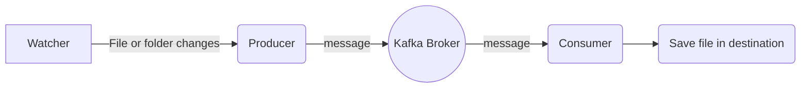

# File Sync with Kafka and NodeJS

## Requirements 

#### * Docker  version 18.09.7, build 2d0083d
####  * Docker Compose version 1.24.0, build 0aa59064
#### * Node  version 11.15.0

## File sync process

# Usage
Before start sync, change .env.example to .env and add your settings 
```js
FOLDER_PRODUCER_SOURCE=./source/  // change here to your target source 
FOLDER_CONSUMER_DESTINATION=./dest/ // change here to your target destination 
KAFKA_HOST=localhost:9092 // If you already have Kafka Broker change here 
```
## Kafka

Kafka Broker used in Docker container to run execute: 
```bash
docker-compose up -d
``` 
## Producer
##### The Producer watch and send changes of path to Kafka Broker.
Into your host source target run:
```bash
npm install
npm run producer
``` 

## Consumer
##### The Consumer receive changes event from Kafka Broker and save files.
Into your host destination target run:
```bash
npm install
npm run consumer
``` 


